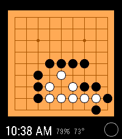

# 9dan — Pebble C watchface

A Pebble watchface that shows **tsumego (go problem) batteries** on a 9 × 9 board.
Shake your wrist to step through the solution!



## Features

- **302 problems** in 3 difficulty sets (easy / intermediate / hard), loaded from
  flash-backed raw resources.
- **Random mirror/rotation per puzzle** — all 8 9×9 symmetries, so 302 becomes
  **2,416 effective orientations**. Verified: every orientation plays legally.
- **Real Go capture rules** on advance (adjacent groups with no liberties are
  removed).
- **Clock** (12h AM/PM or 24h), **battery %**, live **outside temperature**
  (Open-Meteo via the phone — free, no API key).
- **Config options:** problem set (easy, medium, hard), board-reset idle
  (10/30/60 s), new-problem idle (5/15/60 min), clock format, temp units (°C/°F).
- **Green "solved" indicator**, red last-move ring, color-to-play turn stone.

## Quick start

```sh
export PATH="$HOME/.local/bin:$PATH"
pebble package install @rebble/clay     # first clone only
pebble build
pebble install --phone 100.121.218.117 build/watchface-c.pbw
```

Requires the Pebble phone app with **Developer Connection** enabled. The C SDK and
per-platform details are in `TOOLS.md`; the project-specific non-negotiables and
regeneration recipe are in `AGENTS.md`.

## Layout

```
src/c/goface.c        renderer + app state (board, clock, battery, temp, input, config)
src/c/problems.c      problem decode + Go capture rules + mirror/rotate (pure logic)
src/c/settings.c      settings load/save/persist
src/pkjs/             phone side: Clay config page + Open-Meteo weather fetch
resources/*.bin       the 3 problem sets (raw data, flash-backed)
scripts/              data pipeline (build_problems.py + validator) — see scripts/README.md
vendor/go-problems/   Go Game Guru SGF sources (CC BY-NC-SA 4.0)
test/                 host-side decoder/capture/transform tests (compile problems.c natively)
```

## Memory

C build footprint is ~9.8 KB of a 128 KB app heap (~121 KB free). The original
Alloy/JS build OOM'd at ~60 KB used — moving to C freed the heap entirely, which is
what made settings, weather, and all 3 difficulty sets possible.

## Data & tests

Regenerate the problem data and independently validate it with
`scripts/` (README there). Run the host-side tests under `test/` to verify the C
decoder and capture rules against the shipped `.bin` without a watch.

## License

Problem data is from [Go Game Guru](https://gogameguru.com/) and is © their
collection, licensed CC BY-NC-SA 4.0 (see `vendor/go-problems/LICENSE`). The
watchface code here is a noncommercial derived work.

This repository is licensed under the MIT license.
